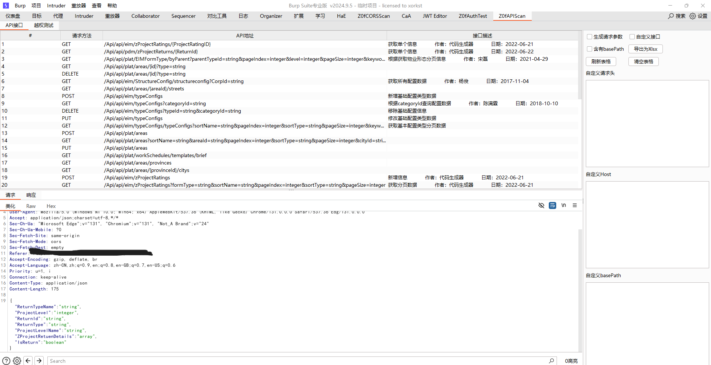
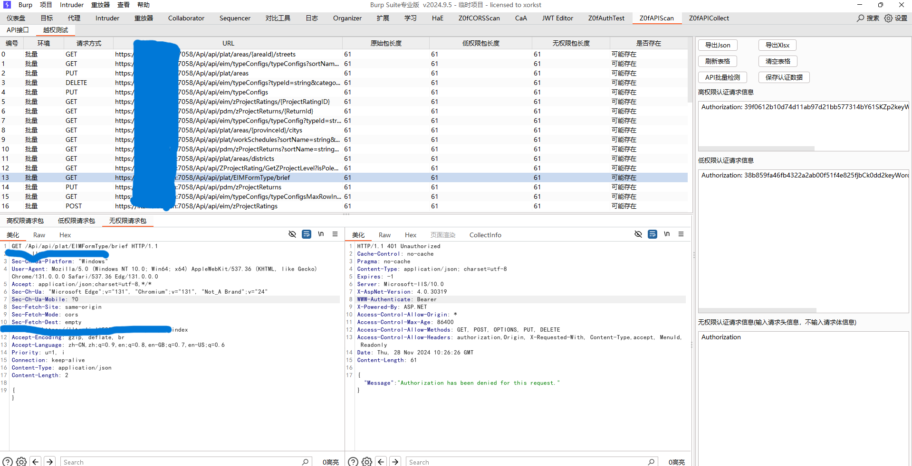
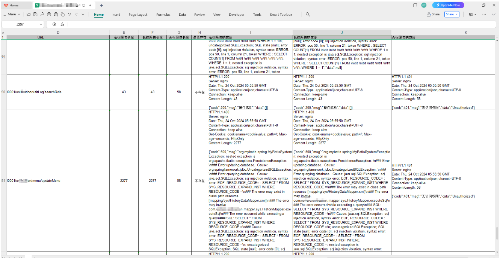

# Z0fSwaggerScan 简介

一款利用 Swagger 文档来完成 API 权限测试的 Burp 插件

## 功能

- Swagger 文档解析
- 一键高低权限测试
- 支持导出 API接口为 Json 和 Xlsx
- 支持导出API接口测试结果为 Json 和 Xlsx
- 自定义高低权限认证请求头信息

## 用法
解析API接口文档


批量检测API


导出越权测试结果


## 编译命令

```bash
mvn clean package -DskipTests
```
